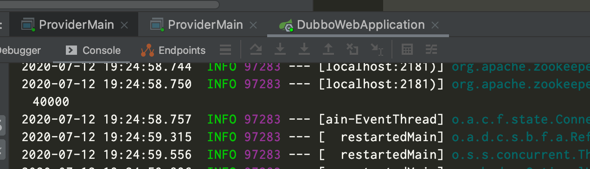
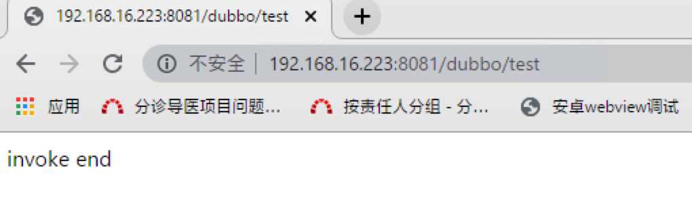
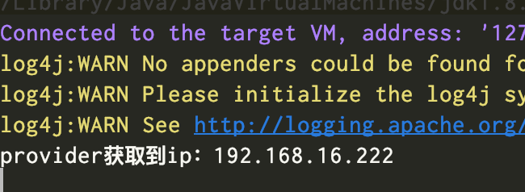
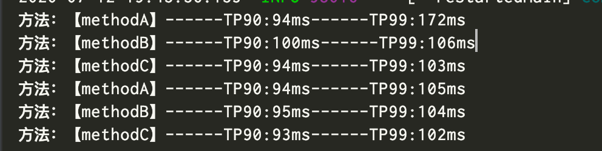

## dubbo作业代码说明文档


### 1.代码结构说明

​	本次作业代码分为3个模块dubbo-common、dubbo-server、dubbo-server-1、dubbo-web

- dubbo-common 包含公共接口定义、filter定义等公共资源
- dubbo-server dubbo服务端
- dubbo-web 调用客户端


### 2.作业一实现

#### 2.1 实现步骤

1. 在dubbo-common定义两个接口

   ```java
   public interface TellMyIpService {
       String tellMyIp();
   }
   
   public interface TellMyIpService1 {
       String tellMyIp();
   }
   ```

2. dubbo-server实现TellMyIpService接口 dubbo-server-1实现TellMyIpService1接口 

   ```java
   @Service(filter = {"filter","-monitorFilter"})
   public class TellMyIpServiceImpl implements TellMyIpService {
   
       public String tellMyIp(String ip) {
           return "got it,client ip is " + ip;
       }
   }
   
   @Service(filter = {"filter","-monitorFilter"})
   public class TellMyIpServiceImpl implements TellMyIpService1 {
   
       public String tellMyIp() {
           return "got it,client ip is " ;
       }
   }
   ```

3. 新增一个IpSetFilter sevrlet过滤器 在请求到达时将ip地址保存到ThreadLocal中

   ```
    @Override
       public void doFilter(ServletRequest servletRequest, ServletResponse servletResponse, FilterChain filterChain)
               throws IOException, ServletException {
           TheadLocalUtil.setIp(servletRequest.getRemoteHost());
           filterChain.doFilter(servletRequest,servletResponse);
       }
   ```
   
   
   
4. 定义ip设置拦截器TransportIPFilter 判断是客户端侧还是服务器侧。

   ```java
   @Activate(group = {CommonConstants.CONSUMER, CommonConstants.PROVIDER})
   public class TransportIPFilter implements Filter {
   
       private final static String IP = "ip";
   
       public Result invoke(Invoker<?> invoker, Invocation invocation) throws RpcException {
   
           //从ThreadLocal中获取ip地址
           if (RpcContext.getContext().isConsumerSide()) {
               System.out.println("consume设置ip:" + TheadLocalUtil.getInstance().getIp());
               RpcContext.getContext().setAttachment(IP, TheadLocalUtil.getInstance().getIp());
           } else {
               Map<String, String> contextAttachments = RpcContext.getContext().getAttachments();
               System.out.println("provider获取到ip：" + contextAttachments.get(IP));
           }
           return invoker.invoke(invocation);
       }
   }
   ```

5. 配置拦截器 在客户端和服务端都添加 META-INF/dubbo/org.apache.dubbo.rpc.Filter文件，并将TransportIPFilter全限定类名配置进去 如：

   ```properties
   filter=filter.TransportIPFilter
   ```

6. 客户端提供http接口 如下 url地址为http://ip:8081/dubbo/test

   ```java
   @Controller
   @RequestMapping("/test")
   public class DubboTestController {
   
       @Reference(filter = {"filter"})
       private TellMyIpService tellMyIpService;
   
       @Reference(filter = {"filter"})
       private TellMyIpService1 tellMyIpService1;
   
       @RequestMapping
       @ResponseBody
       public String testInvoke(HttpServletRequest request) {
           tellMyIpService.tellMyIp();
           tellMyIpService1.tellMyIp();
           return "invoke end";
       }
   }
   ```

#### **2.2 结果验证**

1. **启动两个dubbo服务器端和一个客户端**

**注意运行多个server时需要将服务器的dubbo-provider.properties配置文件中的配置项 dubbo.protocol.port修改成跟第一次启动时不一致，否则会出现端口已占用的情况**



2. **在浏览器访问**http://ip:8081/dubbo/test



3. **服务器端获取到浏览器所在电脑ip并打印**




### 3.作业二实现

#### 2.1 实现步骤

1. 定义接口TestTpService

   ```java
   public interface TestTpService {
   
       int methodA();
   
       int methodB();
   
       int methodC();
   }
   ```

2. 服务器端增加该接口实现类TestTpServiceImpl 三个方法都随机睡眠0-100ms

   ```java
    private int sleep() {
           Random r = new Random();
           int t = r.nextInt(100);
           try {
               Thread.sleep(t);
               lock.lock();
               invokeTimes++;
               return invokeTimes;
           } catch (InterruptedException e) {
               e.printStackTrace();
               return 0;
           } finally {
               lock.unlock();
           }
   }
   ```

   

3. 新建拦截器TPMonitorFilter 改拦截器需要设置@Activate(group = {CommonConstants.CONSUMER}) 标识只在客户端启用

   **核心代码**：

   ```java
   //标识在客户端启用
   @Activate(group = {CommonConstants.CONSUMER})
   //实现Filter接口完成拦截器功能 实现Runnable接口完成定时统计任务
   public class TPMonitorFilter implements Filter, Runnable {
     
     //类初始化时就新建一个循环任务 每5s统计一次
      public TPMonitorFilter() {
           Executors.newSingleThreadScheduledExecutor().scheduleWithFixedDelay(this, 1, 5, TimeUnit.SECONDS);
       }
     //实现Filter的invoke接口，将每次接口调用的情况记录下来
      public Result invoke(Invoker<?> invoker, Invocation invocation) throws RpcException {
       	……
       }
     //实现run接口，完成定时统计任务，并且完成过期无效数据的清理工作
      public void run() {
           ……
       }
   }
   ```

   

4. 客户端创建定时发送请求组件InvokeComponent

   ```java
   @Component
   public class InvokeComponent implements Runnable {
   
     	//去除filter拦截，只使用monitorFilter拦截
       @Reference(filter = {"-filter,monitorFilter"})
       private TestTpService testTpService;
   		
       private static ThreadFactory namedThreadFactory = new ThreadFactoryBuilder()
               .setNameFormat("demo-pool-%d").build();
   		//创建线程池
       private static ExecutorService pool = new ThreadPoolExecutor(5, 200,
               0L, TimeUnit.MILLISECONDS,
               new LinkedBlockingQueue<>(1024), namedThreadFactory, new ThreadPoolExecutor.AbortPolicy());
   
     	//初始化bean时新建一个1s调用一次的定时任务
       public InvokeComponent() {
           Executors.newSingleThreadScheduledExecutor().scheduleWithFixedDelay(this, 1, 1, TimeUnit.SECONDS);
       }
   
     	//定时执行的任务内容
     	//使用线程池创建100个子线程并分别调用三个方法
       @Override
       public void run() {
           for (int i = 0; i < 100; i++) {
               pool.submit(() -> {
                   testTpService.methodA();
                   testTpService.methodB();
                   testTpService.methodC();
               });
           }
       }
   }
   ```

#### 2.2 结果验证



